# 01-Lab1
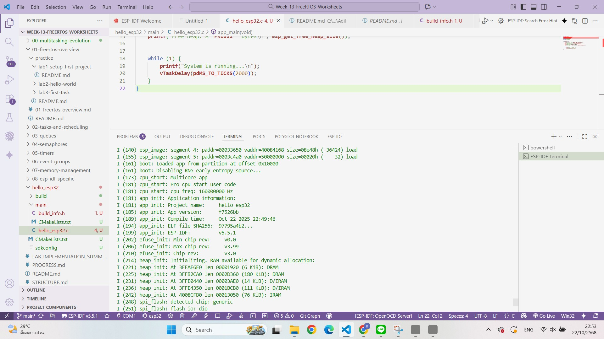

# 01-Lab2

# 01-Lab3
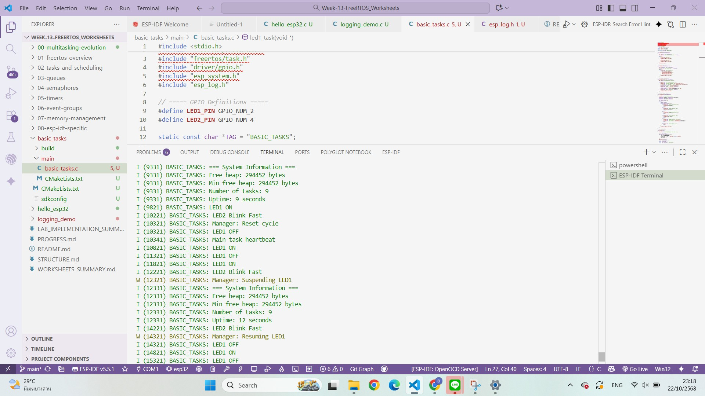

# 02-Lab1
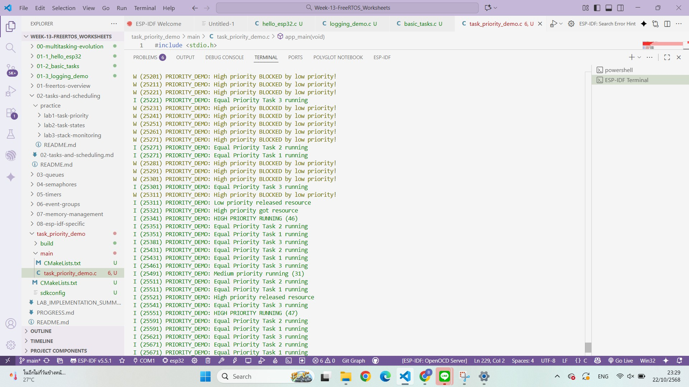

# 02-Lab2
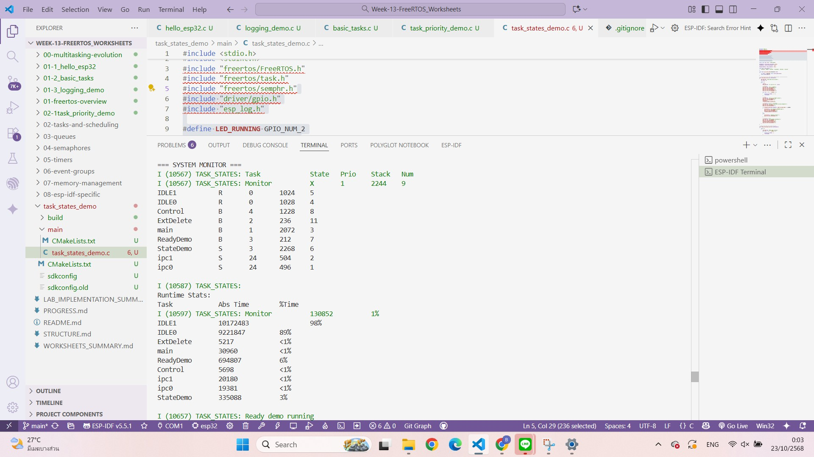

# 02-Lab3
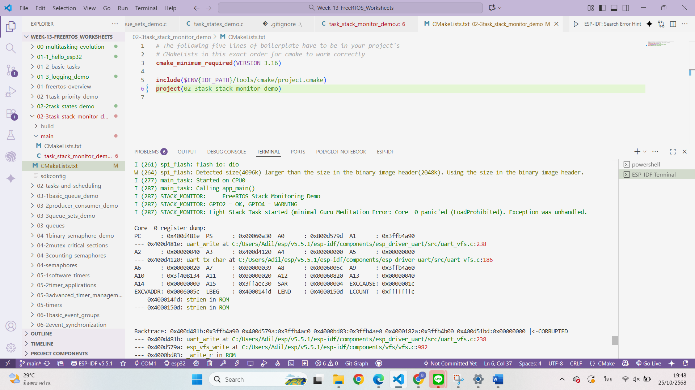

# 03-LAb1
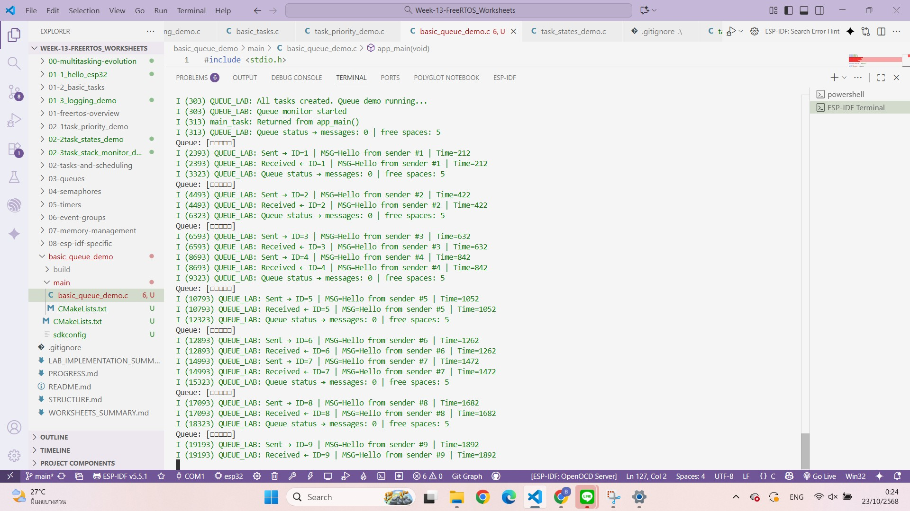

# 03-LAb2

# 03-LAb3
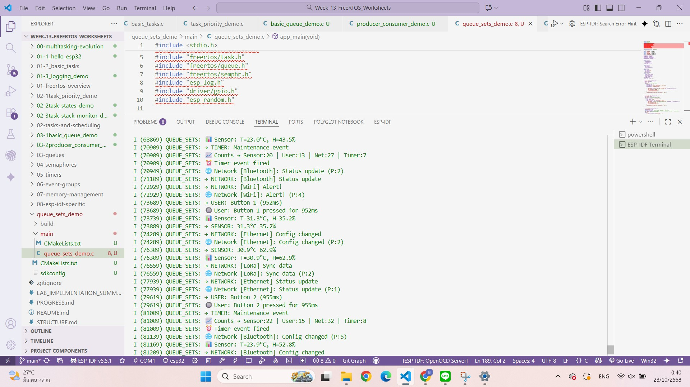

# 04-LAb1
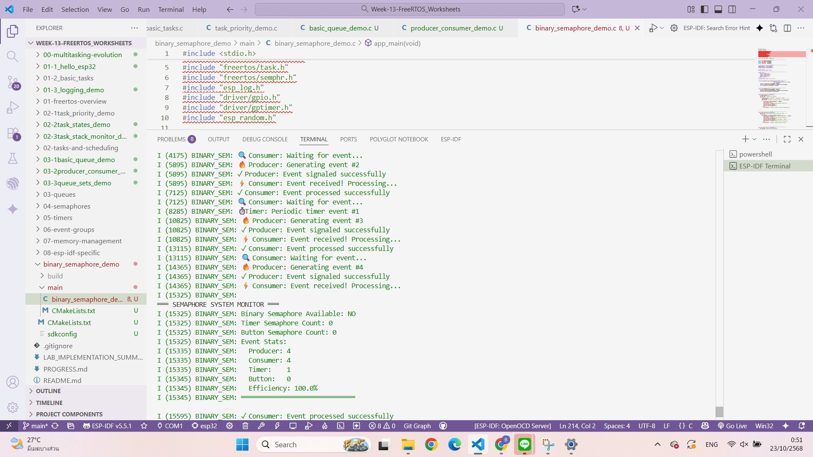

# 04-LAb2
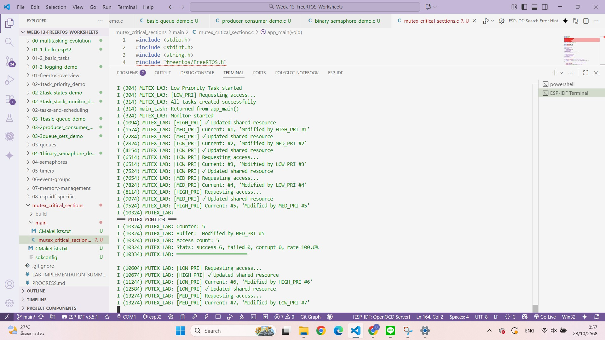

# 04-LAb3
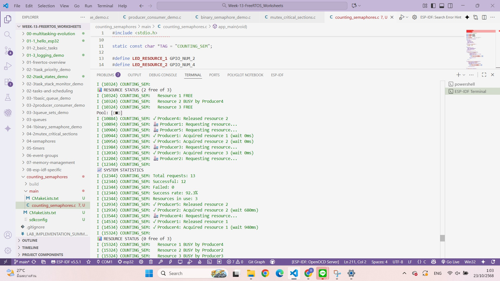

# 05-LAb1
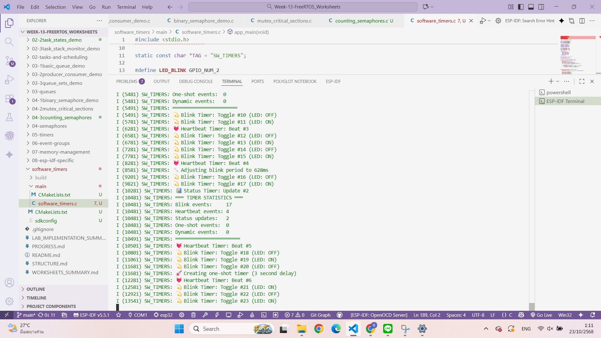

# 05-LAb2
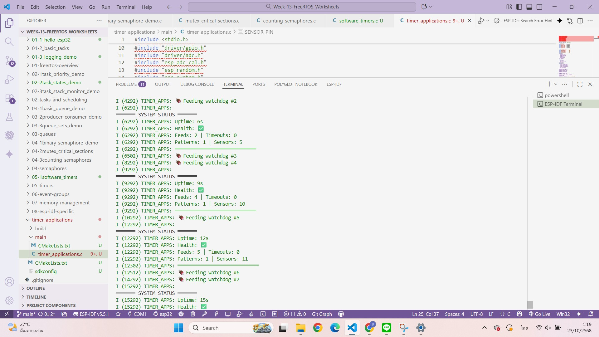

# 05-LAb3
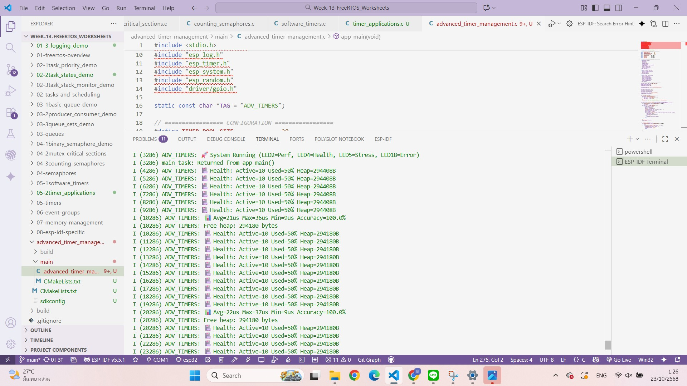

# 06-LAb1
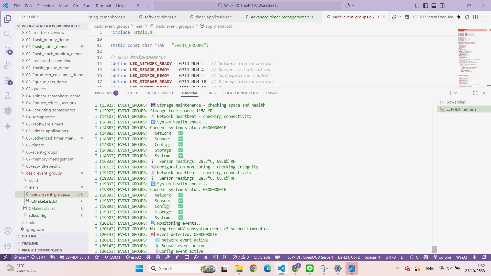

# 06-LAb2
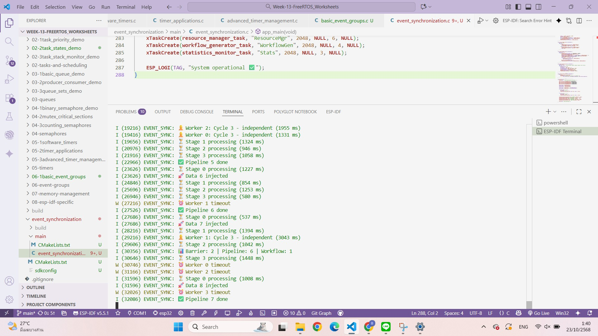

# 06-LAb3

# 07-LAb1
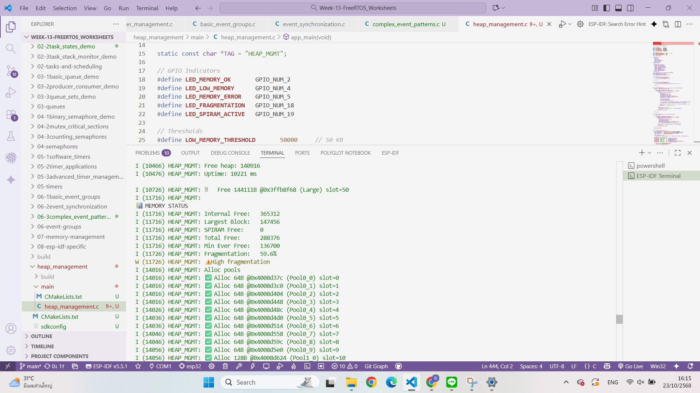

# 07-LAb2
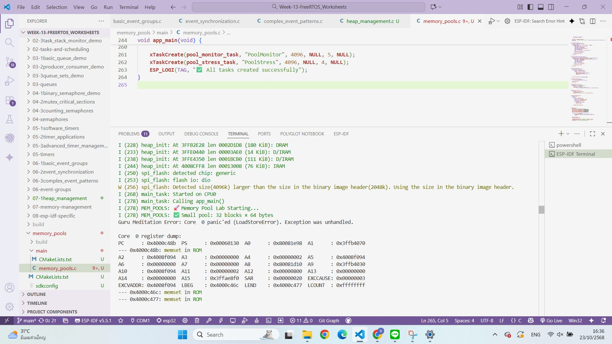

# 07-LAb3
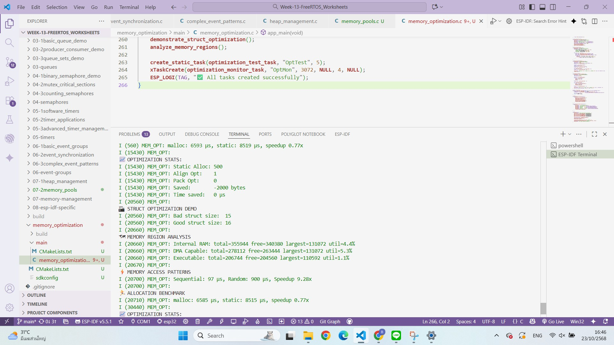

# 08

